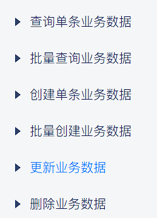

# 氚云 OpenAPI 快速使用



## 环境配置
- `.env` 仅包含：`H3YUN_ENGINE_CODE`、`H3YUN_SECRET`、`H3YUN_TIMEOUT`
- 业务参数通过 JSON 配置文件传入，脚本与 CLI 支持 `--env-file` 与自动搜索：`./.env`、`Web_Service/氚云/.env`、`Web_Service/氚云/test/h3yun.env`

## 单条新增
- 客户端方法：`create_biz_object`（`Web_Service/氚云/src/h3yun_client.py:62`）
- 关键参数：`SchemaCode`、`BizObject`（JSON 字符串/对象）、`IsSubmit=true`
- CLI 示例：`python -m Web_Service.氚云.src.cli create-one --schema D287764relabel --biz '{"IP":"114.114.114.114"}' --submit true`（`Web_Service/氚云/src/cli.py:67`）

## 批量新增
- 客户端方法：`create_biz_objects`（`Web_Service/氚云/src/h3yun_client.py:70`）
- 关键参数：`BizObjectArray`（元素为 JSON 字符串），`IsSubmit=true`
- CLI 示例：`python -m Web_Service.氚云.src.cli create-many --schema D287764relabel --biz-array Web_Service/氚云/test/batch_create.json --submit true`（`Web_Service/氚云/src/cli.py:72`）

## 单条更新
- 客户端方法：`update_biz_object`（`Web_Service/氚云/src/h3yun_client.py:97`）
- 建议使用控件编码顶层字段进行最小更新（如 `IP`）
- 脚本示例：`python Web_Service/氚云/scripts/update_and_verify.py --schema D287764relabel --id a3f8441a-39b1-4484-b6b6-e67e68e61c11 --ip 114.114.114.114`（打印 `update_result_successful` 与 `verify_ip`）

## 单条删除
- 客户端方法：`remove_biz_object`（`Web_Service/氚云/src/h3yun_client.py:105`）
- 脚本示例：`python Web_Service/氚云/scripts/remove_and_verify.py --schema D287764relabel --id a3f8441a-39b1-4484-b6b6-e67e68e61c11`（打印 `remove_successful` 与 `verify_deleted`）
- CLI 示例：`python -m Web_Service.氚云.src.cli remove-one --schema D287764relabel --id a3f8441a-39b1-4484-b6b6-e67e68e61c11`（`Web_Service/氚云/src/cli.py:95`）

## 导出 CSV
- CLI 命令：`python -m Web_Service.氚云.src.cli export-csv --schema D287764relabel --out document/export/sample.csv --from 0 --to 500`（`Web_Service/氚云/src/cli.py:77`）
- 支持 `--matcher-file` 过滤与 `--columns` 列选择，输出为 `UTF-8-SIG`

## 读取
- 单条读取：`python -m Web_Service.氚云.src.cli load-one --schema D287764relabel --id a3f8441a-39b1-4484-b6b6-e67e68e61c11`（`Web_Service/氚云/src/cli.py:52`）
- 批量读取：`python -m Web_Service.氚云.src.cli load-many --schema D287764relabel --matcher-file Web_Service/氚云/test/matcher.json`（`Web_Service/氚云/src/cli.py:56`）

## 常见注意
- 终端执行：避免在 Python REPL 中运行外部命令，使用空闲 PowerShell 终端执行
- 字段编码：更新时使用控件编码（如 `IP`）顶层字段，避免错误路径导致清空
- 参数来源：`--args` 优先，其次 `--env-file` 与 `.env`，亦可使用测试文件（如 `Web_Service/氚云/test/update_biz_ip.json`、`target_biz_id.txt`）
## 上传附件
- 客户端方法：`upload_attachment`（`Web_Service/氚云/src/h3yun_client.py:108`）
- 批量上传脚本：`Web_Service/氚云/scripts/upload_attachments.py`
- 配置示例：`Web_Service/氚云/config/upload.pic.json`

```json
{
  "schema": "D287764relabel",
  "id": "e6d97162-3b23-4e5c-aba2-95d42ca52534",
  "field": "pic",
  "dir": "Web_Service/氚云/image/changelog",
  "patterns": ["*.png", "*.jpg"]
}
```
- 执行示例：`python Web_Service/氚云/scripts/upload_attachments.py --config Web_Service/氚云/config/upload.pic.json`

## 下载附件
- 客户端方法：`download_attachment`（`Web_Service/氚云/src/h3yun_client.py:128`）
- 批量下载脚本：`Web_Service/氚云/scripts/download_attachments.py`
- 配置示例：`Web_Service/氚云/config/download.pic.json`

```json
{
  "schema": "D287764relabel",
  "id": "e6d97162-3b23-4e5c-aba2-95d42ca52534",
  "field": "pic",
  "out": "Web_Service/氚云/download/pic"
}
```
- 执行示例：`python Web_Service/氚云/scripts/download_attachments.py --config Web_Service/氚云/config/download.pic.json`
